# 📄 Références

⬅️ [Retour à la page principale](../README.md)

📄 [PDF des diapositives](./Smartphones_et_surveillance.pdf)

## Diapositive 2 - Collaboration entre acteurs de la surveillance commerciale et étatique

*Mémoires Vives*, Edward Snowden, Le Seuil, 2019
- [Babelio](https://www.babelio.com/livres/Snowden-Memoires-vives/1162306)
- [pdf (archive)](https://ia902909.us.archive.org/0/items/edward-snowden-memoire-vive-2019/Edward%20Snowden%20%E2%80%93%20Me%CC%81moire%20vive%20%282019%29.pdf)

p. 266

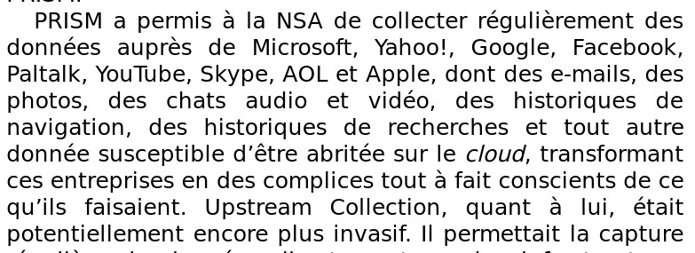

## Diapositive 3 - Motivations & Acteurs de la surveillance commerciale

### Politique de confidentialité de Google

- [Consulter en ligne](https://policies.google.com/privacy?hl=fr)
- [pdf (archive)](https://www.gstatic.com/policies/privacy/pdf/20251211/mfsjkv52/google_privacy_policy_fr_eu.pdf)

Captures d'écran issues de la version du 11 décembre 2025

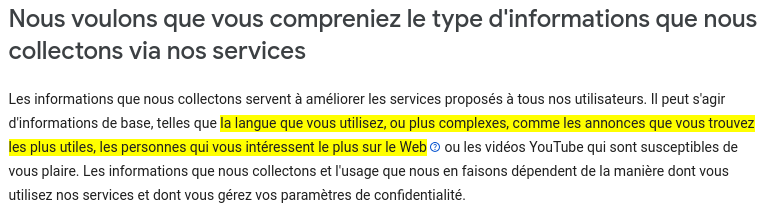

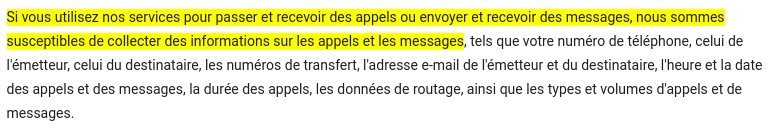

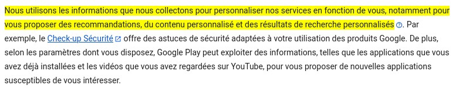

### Politique de confidentialité de Microsoft

- [Consulter en ligne](https://www.microsoft.com/fr-fr/privacy/privacystatement)

Captures d'écran issues de la version de décembre 2025

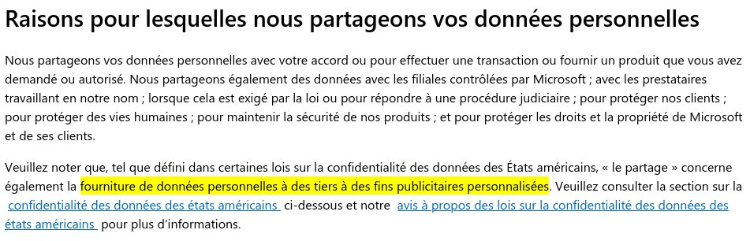

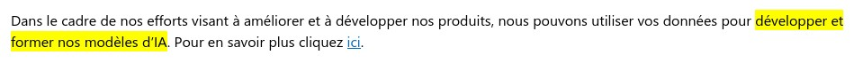

### Politique de confidentialité de Meta

- [Consulter en ligne](https://www.facebook.com/privacy/policy?locale=fr_FR)

Captures d'écran de la version du 16 décembre 2025

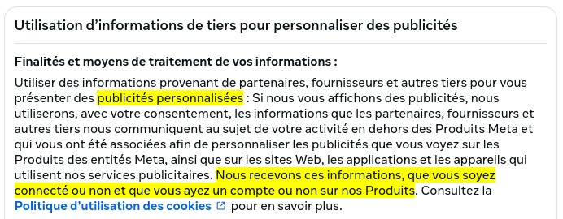

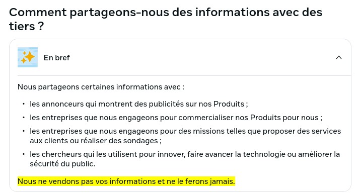

## Diapositive 4 - Motivations & acteurs de la surveillance étatique

### *Le Piège américain*, Frédéric Pierucci, Jc lattès, 2019

- [Babelio](https://www.babelio.com/livres/Pierucci-Le-piege-americain/1113632)

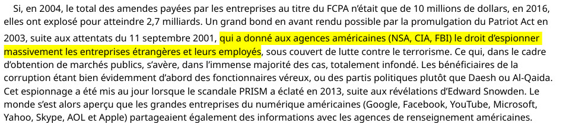

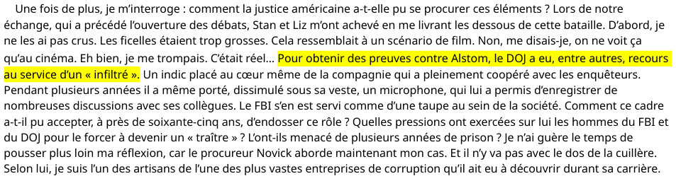

### *Comment des dirigeants européens, dont Angela Merkel, ont été espionnés par la NSA depuis le Danemark*, Le Monde, 30 mai 2021

- [Lire en ligne](https://www.lemonde.fr/pixels/article/2021/05/30/comment-des-dirigeants-europeens-ont-ete-espionnes-par-la-nsa-depuis-le-danemark_6082102_4408996.html)
- [Archive](https://archive.wikiwix.com/cache/index2.php?url=https%3A%2F%2Fwww.lemonde.fr%2Fpixels%2Farticle%2F2021%2F05%2F30%2Fcomment-des-dirigeants-europeens-ont-ete-espionnes-par-la-nsa-depuis-le-danemark_6082102_4408996.html#federation=archive.wikiwix.com&tab=url)

### *Mémoires Vives*, Edward Snowden, Le Seuil, 2019

- [Babelio](https://www.babelio.com/livres/Snowden-Memoires-vives/1162306)
- [pdf (archive)](https://ia902909.us.archive.org/0/items/edward-snowden-memoire-vive-2019/Edward%20Snowden%20%E2%80%93%20Me%CC%81moire%20vive%20%282019%29.pdf)

p.267

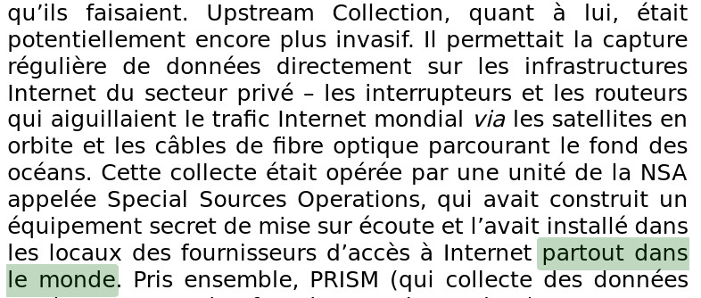

## Diapositive 5 - Historique de la surveillance généralisée

- *Surveillance Globale*, Wikipedia ([consulter en ligne](https://fr.wikipedia.org/wiki/Surveillance_globale))
- *Patriot Act*, Wikipedia ([consulter en ligne](https://fr.wikipedia.org/wiki/USA_PATRIOT_Act))

## Diapositive 6 - Matérialisation de la surveillance généralisée

Débat à l'assemblée nationale sur la vidéosurveillance algorithmique, nommée *« vidéoprotection* algorithmique » dans le projet de loi, le 16 décembre 2025:
[Consulter en ligne](https://www.assemblee-nationale.fr/dyn/17/comptes-rendus/seance/session-ordinaire-de-2025-2026/deuxieme-seance-du-mardi-16-decembre-2025)

## Diapositive 7 - Capteurs d'un smartphone

- *Présentation des capteurs*, Android Developers (présente la liste des capteurs pris en charge par Android) [(consulter en ligne)](https://developer.android.com/develop/sensors-and-location/sensors/sensors_overview?hl=fr)

## Diapositive 10 - Surveillance de masse illégale ?

- *Une instance judiciaire américaine considère que la surveillance de masse exercée par la NSA est illégale*, Amnesty, 7 mai 2015 [(consulter en ligne)](https://www.amnesty.org/fr/latest/news/2015/05/us-court-rules-nsa-mass-surveillance-illegal/)

- Source de la photo en diapositive : [@snowden, x](https://x.com/snowden/header_photo)

## Diapositive 11 - Citation Snowden

### *Mémoires Vives*, Edward Snowden, Le Seuil, 2019

- [Babelio](https://www.babelio.com/livres/Snowden-Memoires-vives/1162306)
- [pdf (archive)](https://ia902909.us.archive.org/0/items/edward-snowden-memoire-vive-2019/Edward%20Snowden%20%E2%80%93%20Me%CC%81moire%20vive%20%282019%29.pdf)

p. 217 (citation complète)

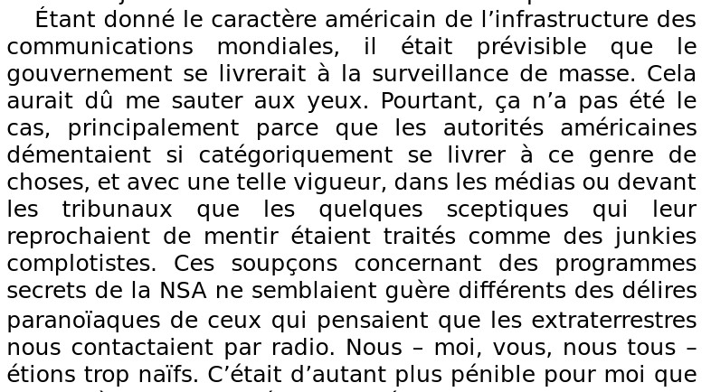

## Diapositive 12 - James Cappler au Sénat

Source de l'anecdote et des images : Laura Poitras, *Citizen Four*, 18:10 ([visionner en ligne](https://youtu.be/EHAz8v8F1nA?t=1090))

## Diapositive 15 - Chat Control

Articles présentés dans la diapositive:

- *Pédocriminalité : l’outil « Chat Control », qui scanne vos messageries, fait polémique*, Le Point, par Julie Malo, 12 octobre 2025 [(consulter en ligne)](https://www.lepoint.fr/societe/pedocriminalite-l-outil-chat-control-qui-scanne-vos-messageries-fait-polemique-12-10-2025-2600773_23.php)
- *Chat Control : on fait le point*, La Quadrature du Net, 3 octobre 2025 [(consulter en ligne)](https://www.laquadrature.net/2025/10/03/chat-control-on-fait-le-point/)
- *« Chat Control » : le projet européen de surveillance des messageries largement abandonné*, Le Monde, 31 octobre 2025 [(consulter en ligne)](https://www.lemonde.fr/pixels/article/2025/10/31/chat-control-le-projet-europeen-de-surveillance-des-messageries-largement-abandonne_6650578_4408996.html)
- *Vie privée : l’UE fait marche arrière sur le « Chat Control » et le scan des messages privés*, Le Parisien avec AFP, 30 octobre 2025 [(consulter en ligne)](https://www.leparisien.fr/high-tech/vie-privee-lue-fait-marche-arriere-sur-le-chat-control-et-le-scan-des-messages-prives-30-10-2025-6I73FWKWKBCJ3ORNK2XO3NU6HU.php)
- *«Chat Control» et l’UE : protéger les enfants, oui, mais pas au prix d’une surveillance de masse*, Libération, par Rodrigo Arenas, député LFI, 17 septembre 2025 [(consulter en ligne)](https://www.liberation.fr/idees-et-debats/tribunes/chat-control-et-lue-proteger-les-enfants-oui-mais-pas-au-prix-dune-surveillance-de-masse-20250917_K6L5EIUCQFDK3EU3JASMRTJTCY/)

## Diapositive 18 - Analogie

Les visuels des ressources ont été réalisés avec l'éditeur de cartes du jeu [Wesnoth](https://www.wesnoth.org/).

## Diapositive 27 - Exemple d'exploitation

Pour ceux qui souhaitent aller plus loin, voici un long article présentant dans le détail le moyen d'exploiter une faille de sécurité avec un processus similaire à celui qui a été vulgarisé lors de la conférence. Il utilise un fichier audio et non pas une photo mais l'idée est la même. Il est très récent (14 janvier 2025) ce qui fait qu'à l'heure de la rédaction de ces lignes, les téléphones n'ayant plus de possibilité de mise à jour sont **vulnérables** à cette attaque spécifiquement.

> [!WARNING]
> L'article, en anglais, est très technique et nécessite des compétences pointues en programmation, sécurité informatique et architecture des microprocesseurs pour être compris.

*A 0-click exploit chain for the Pixel 9 Part 1: Decoding Dolby*, Natalie Silvanovich, Google Project Zero, 14 janvier 2026 [(consulter en ligne)](https://projectzero.google/2026/01/pixel-0-click-part-1.html)

## Diapositive 28 - Pegasus

Liste des articles présentés sur la diapositive :
- *Logiciel espion Pegasus : l’enquête «tentaculaire» confiée à un juge d’instruction en France*, Le Parisien avec AFP, 2 juillet 2022 [(consulter en ligne)](https://www.leparisien.fr/faits-divers/logiciel-espion-pegasus-lenquete-tentaculaire-confiee-a-un-juge-dinstruction-en-france-02-07-2022-RG5DOF6AGVCVHMM3WNNMPF7ZY4.php)
- *« Pegasus est l’arme de cybersurveillance la plus puissante du marché » : les extraits du livre-enquête sur le logiciel espion*, Laurent Richard et Sandrine Rigaud, Le Monde, 12 septembre 2023

## Diapositive 30 - Déclaration de Nicolas Lerner, directeur de la DGSE

- *La probabilité d'un deuxième 13-Novembre "a considérablement diminué", selon Nicolas Lerner (DGSE)*, France Inter, 10 novembre 2025 [(visionner en ligne)](https://www.youtube.com/watch?v=8ZOMG4JWFPM)

L'image sur la diapositive est une capture d'écran de la vidéo de l'entretien.

La séquence citée sur la diapositive, elle, se trouve à [26:18](https://youtu.be/8ZOMG4JWFPM?t=1546)

## Diapositive 33 - Mises à jour

- *Vérifier la version d'Android installée et la mettre à jour*, Aide Android de Google [(consulter en ligne)](https://support.google.com/android/answer/7680439?hl=fr)

## Diapositive 34 - 1 milliard de smartphones obsolètes

Articles présentés sur la diapositive :

- *30% des smartphones Android sont obsolètes et vulnérables avec 1 milliard de victimes potentielles*, Guillaume Belfiore, Clubic, 29 décembre 2025 [(consulter en ligne)](https://www.clubic.com/actualite-592999-des-smartphones-android-sont-obsoletes-et-vulnerables-avec-1-milliard-de-victimes-potentielles.html)

- *Bulletin sur la sécurité d'Android – Décembre 2025*, android.com, 1er décembre 2025 [(consulter en ligne)](https://source.android.com/docs/security/bulletin/2025-12-01?hl=fr)

Android [publie mensuellement](https://source.android.com/docs/security/bulletin?hl=fr) des bulletins de sécurité décrivant les failles de sécurité trouvées, leur gravité et les risques encourus en cas d'exploitation. N'hésitez pas à les consulter pour être au courant des failles plus récentes.

## Diapositive 37 - Open Source

Pour en savoir plus sur l'Open Source, consultez la page [Wikipedia](https://fr.wikipedia.org/wiki/Open_source) associée.

## Diapositive 40 - Android partiellement Open Source

Le code source d'AOSP, la couche open source d'Android est disponible [ici](https://android.googlesource.com/).

## Diapositive 46 - GrapheneOS

- Site officiel : https://grapheneos.org/
- Twitter / X : [@GrapheneOS](https://x.com/grapheneos)

- Sandbox (confinement) des services Google dans GrapheneOS (anglais) : https://grapheneos.org/usage#sandboxed-google-play

## Diapositive 47 - GrapheneOS & médias

Liste des articles présentés sur la diapositive :

- *Google Pixel et GrapheneOS : la botte secrète des narcotrafiquants pour protéger leurs données de la police*, Julien Constant, Le Parisien, 19 novembre 2025 [(consulter en ligne)](https://www.leparisien.fr/faits-divers/google-pixel-et-grapheneos-la-botte-secrete-des-narcotrafiquants-pour-proteger-leurs-donnees-de-la-police-19-11-2025-NTGPQE4JCNGEHLF7XGIQ3CCA2I.php)
- *Téléphones protégés utilisés par les narcotrafiquants : « Rien n’est inviolable ! »*, Julien Constant, Le Parisien, 19 novembre 2015 [(consulter en ligne)](https://www.leparisien.fr/faits-divers/telephones-proteges-utilises-par-les-narcotrafiquants-rien-nest-inviolable-19-11-2025-3PP34GIBAJGH3EZOVEJVT7OMU4.php)

> [!WARNING]
> Ces articles comportent plusieurs inexactitudes. Contrairement à ce qui est écrit, GrapheneOS ne sert pas à dissimuler les échanges. Il s'agit d'un système d'exploitation axé sur la sécurité et la confidentialité, pas d'un moyen de communication ou d'une messagerie. Par exemple, communiquer par SMS sur GrapheneOS n'est pas confidentiel, et les SMS ne sont pas dissimulés, notamment aux yeux des antennes. GrapheneOS rend seulement la pénétration du téléphone plus compliquée aux forces de l'ordre si elles ne disposent pas du code pour déverrouiller l'appareil.
> 
> Par ailleurs, GrapheneOS ne détruit pas les données « en cas d'intrusion ». Il possède toutefois une option nommée [« duress PIN »](https://grapheneos.org/features#duress). Il s'agit d'un code spécial qui, lorsqu'il est tapé notamment sur l'écran de verrouillage, efface entièrement les données du téléphone de manière irréversible et ininterruptible. Cela n'a rien à voir avec une intrusion. Il s'agit plutôt d'un moyen de déjouer une tentative d'intrusion.
>
> L'affirmation comme quoi les Pixel sous GrapheneOS « ne partagent pas les données sur les serveurs » est absurde. Tout appareil connecté à internet partage des informations avec des serveurs, selon les actions des utilisateurs. Évidemment, GrapheneOS ne restreint pas l'accès à internet, et ne fait rien en ce sens.

Vous pouvez consulter la réaction de GrapheneOS à ces articles [sur X](https://x.com/GrapheneOS/status/1993397390087532878).

## Diapositive 48 - Inconvénients

- Liste des téléphones prenant en charge GrapheneOS (anglais) : https://grapheneos.org/faq#supported-devices
- Liste des téléphones prenant en charge GrapheneOS dans le futur (anglais) : https://grapheneos.org/faq#future-devices
- Installer GrapheneOS (anglais) : https://grapheneos.org/install/

## Diapositive 49 - Installer GrapheneOS

Extrait du JT de France 2 parlant de GrapheneOS (22 novembre 2025)

> [!WARNING]
> Cet extrait contient lui aussi des erreurs grossières sur GrapheneOS.

[Lien direct vers la vidéo](./res/jt-france-2-grapheneos.mp4)

## Diapositive 50 - Installer GrapheneOS

Lien du code QR sur la diapositive : https://grapheneos.org/install/web

## Diapositive 51 - Citation

Lien du tweet présenté sur la diapositive : https://x.com/pbeyssac/status/1992668055877656984